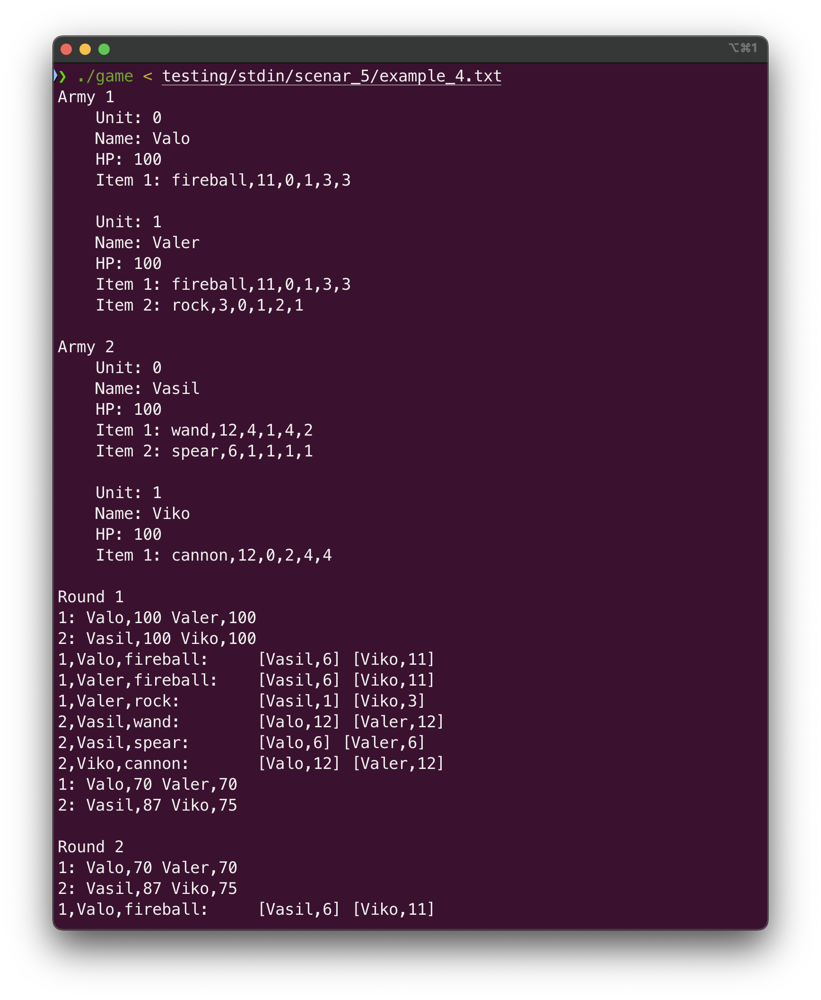
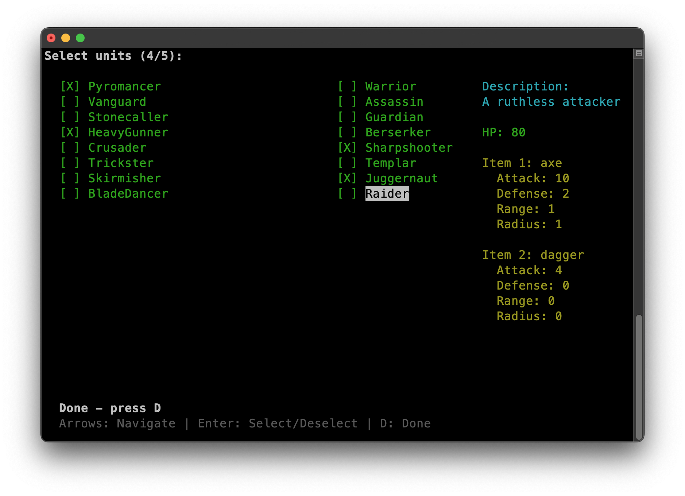

# Medieval War Simulation
This is a pet project of STU. A game about medieval warfare. Just an engine

## How to play?
1. First, you write how many units will be in the first army (from 1 to 5)
2. Then, you write a name and an item for each unit. A unit can contain 1 or 2 items. All available items are in the file data.c. One unit per line
3. After that, you repeat all the procedures for Army No. 2. and the simulation will start. You will see all the rounds and the winning army

## How to install? (Linux/Mac)
1. `git clone https://github.com/laushkin1/MedievalWar`
2. `cd MedievalWar`
3. `gcc -std=c11 -Wall -Wextra -Wuninitialized -pedantic -g src/data.c src/main.c -I include -o game -lm`
4. After all these steps, you can run the game by `./game`

## Screenshots
| 1                       | 2                       |
|-------------------------|-------------------------|
|  |  |

## Author
- [@laushkin1](https://github.com/laushkin1)
