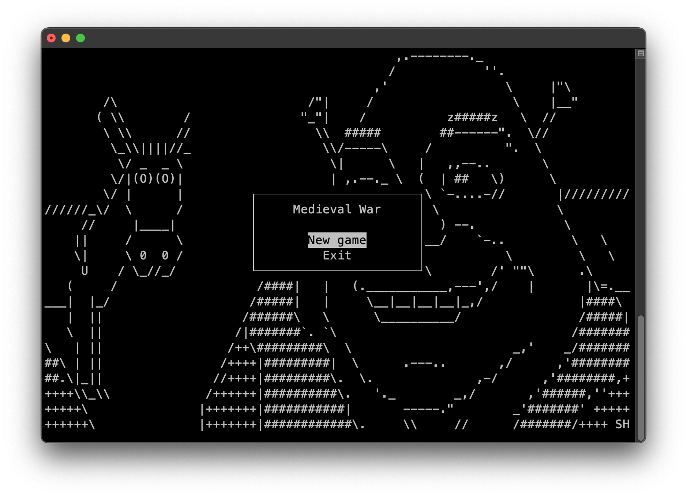

# Medieval War Simulation
This is a pet project of STU. A game about medieval warfare.

## How to play?
1. First, you need to choose a game mode. For AI, the army is generated randomly, while for players you need to create your own army from the available characters.
2. You can choose from 1 to 5 characters. After you make your army - two armies will appear on the screen.
3. At the core of the game, you can see a 5x5 battlefield with your units in green and enemy units in red.
   - Use the arrows to move.
   - You can only move your units.
   - All available moves will be highlighted in blue.
   - If there is an enemy in your range, you can attack them by clicking on them. They will be highlighted in yellow.
4. On the right side of the battlefield you can see information about the current unit.
5. At the bottom of the battlefield are information messages.

## How to install? (Linux/Mac)
1. `git clone https://github.com/laushkin1/MedievalWar`
2. `cd MedievalWar`
3. `gcc -std=c11 -Wall -Wextra -Wuninitialized -pedantic -g src/data.c src/main.c -I include -o game -lncurses -lm`
4. After all these steps, you can run the game by `./game`

## Screenshots
|                         |                         |
|-------------------------|-------------------------|
|  |  |
|                         |                         |
|  |  |
|                         |                         |
|  |  |

## Author
- [@laushkin1](https://github.com/laushkin1)
